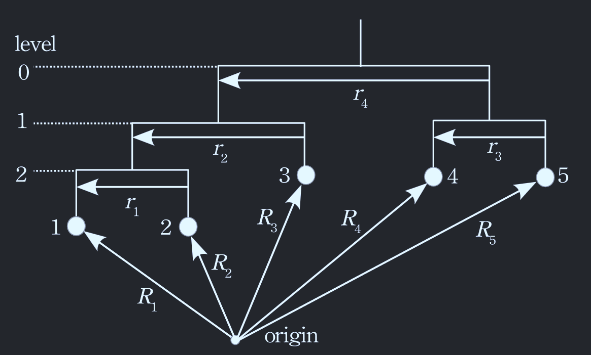

# System initialization

## Hierarchical system initialization

A simulation in `Syzygy.jl` begins by setting up the system you want to simulate. This is done by the `multibodysystem` function, which takes in the structural arguments of the bodies in the system - masses, radii, stellar types, luminosities, etc... -, and the orbital parameters of the binaries - semi-major axes, eccentricities, etc.. . The masses are set as the first positional argument, while all other parameters are set using keyword arguments. `Syzygy.jl` uses units by utilizing [Unitful.jl](https://painterqubits.github.io/Unitful.jl/stable/) and [UnitfulAstro.jl](https://juliaastro.org/UnitfulAstro.jl/stable/), both of which are re-exported upon loading the package. Arguments that are not unitless need to be defined with a unit when initializing the system. You can see which keyword arguments are accepted by using help _help_ functionality on the `multibodysystem` function, or printing the dictionary `Syzygy.multibodysystem_parameter_aliases`, which also shows the different aliases you can use for various parameters. 

A hierarchical system is set up following [Hamers & Portegies Zwart 2016](https://doi.org/10.1093/mnras/stw784), with labeling being done as shown in this figure (Evans 1968):



!!! important
    The code for setting up the hierarchy (converting the orbital elements into state vectors) is either heavily inspired by, or directly taken from [NbodyGradient.jl](https://github.com/ericagol/NbodyGradient.jl). All credits go to the authors.

### Examples

```julia

binary = multibodysystem([1.0, 1.0]u"Msun", a=1.0u"AU", e=0.4) # set up a binary system with two 1 solar-mass stars, in an orbit with 1 semi-major axis of 1 AU and an eccentricity of 0.4
multibodysystem([1.0, 1.0]u"Msun", semi_major_axis=1.0u"AU", eccentricity=0.4) == binary # parameter aliases
triple = multibodysystem([2.0, 1.0, 3.0]u"Msun", a=[0.1, 0.5]u"Rsun", e=[0.1, 0.4], i=[π/2, 0.0]u"rad") # hierarchical triple
quadruple = multibodysystem([1.0, 1.0, 1.0, 1.0]u"Msun", a=[0.1, 0.5, 10.0]u"Rsun", e=[0.1, 0.4, 0.2], i=[90.0, 45.0, 0.0]u"degree", hierarchy=[4, 2, 1]) # 2+2 quadruple

# set up a binary black hole system
bh1_mass = 9.62u"Msun"
bh2_mass = 8.4u"Msun"

G, c = GRAVCONST, Syzygy.LIGHTSPEED # constants
bh1_radius = 2*G*bh1_mass/c^2 
bh2_radius = 2*G*bh2_mass/c^2

binary_blackholes = multibodysystem([bh1_mass, bh2_mass], a=15.3u"Rsun", R=[bh1_radius, bh2_radius], stellar_type=[14, 14]) 
```

If you wanted to set up the system in the above figure - a quintuple system - you would do

```julia
masses = ones(5)u"Msun"
r1 = 1.0u"Rsun"
r2 = 5.0u"Rsun"
r3 = 1.0u"Rsun"
r4 = 10.0u"Rsun"
hierarchy = [5, 1, 2, 1] # 1 binary on level 2, 2 on 1, and 1 on 2

quintuple = multibodysystem(masses, a=[r1, r2, r3, r4], hierarchy=hierarchy)
```

The components of the system can be accessed via `system.binaries[index]`, with `index` being an integer from 1 to number of binaries, and `system.particles[index]`, for the individual particles. A binary or particle are instances of the `Binary` or `Particle` type, both of which have a number of fields containing information about their state and internal structure.

Example of a 4-planet system:

```julia
planet_masses = rand(4)u"Mearth"
star_mass = 1.2u"Msun"
semi_major_axes = [1, 2, 3, 4]u"AU"

plantery_system = multibodysystem([star_mass, planet_masses...], sma=semi_major_axes)
```

## Arbitrary system initialization

A system can also be initialized using just masses, positions, and velocities (in addition to structural arguments like radius etc.). To do this, call `multibodysystem` with positional arguments masses, positions, velocities.

### Example

```julia
masses = [2.0, 1.0]u"Msun"
r1 = [-1.0, 0.0, 0.0]u"Rsun"
r2 = [1.0, 0.0, 0.0]u"Rsun"

v1 = [0.0, -25.0, 0.0]u"km/s"
v2 = [0.0, 25.0, 0.0]u"km/s"

twobody = multibodysystem(masses, [r1, r2], [v1, v2], R=[1.5, 0.5]u"Rsun")
```


!!! note
    `Syzygy.jl` uses units when initializing a system and when postprocessing a simulation results. The units are discarded before the actual simulation begins in order to ensure performance. The initial conditions and parameters that are sent to the ODE solver are always the preferred units of the respective dimensions. The default unit system is solar mass ($M_\odot$), solar radii ($R_\odot$), and year. If you want to change the default unit system, you have to call the `set_units`, which accepts a string with the name of the unit system, i.e. "SI", "CGS", "Solar".
