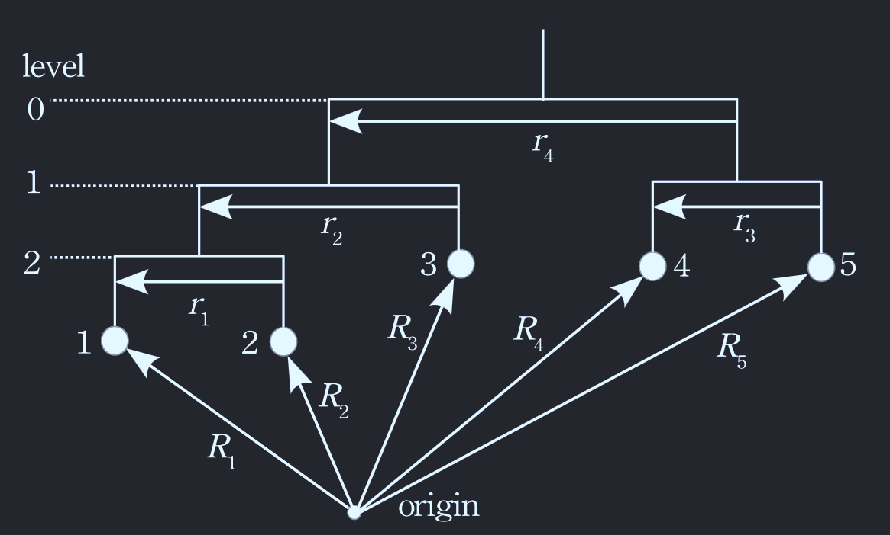

# System initialization

## Hierarchical system initialization

A simulation in `Syzygy.jl` begins by setting up the system you want to simulate. This is done by the `multibodysystem` function, which takes in the structural arguments of the bodies in the system - masses, radii, stellar types, luminosities, etc... -, and the orbital parameters of the binaries - semi-major axes, eccentricities, etc.. . The masses are set as the first positional argument, while all other parameters are set using keyword arguments. 

!!! note
    `Syzygy.jl` uses units by utilizing [DynamicQuantities](https://github.com/JuliaPhysics/DynamicQuantities.jl), which is re-exported upon loading the package. Arguments that are not unitless need to be defined with a unit when initializing the system. Standard units are specified using a [`u_str`](https://juliaphysics.github.io/DynamicQuantities.jl/dev/units/#DynamicQuantities.UnitsParse.@u_str), while astrophysical units like solar mass and radius can be accessed by prefixing `Constants`, i.e. `u"Constants.M_sun"`. For conveniance, certain stellar units are aliased as `Msun`, `Rsun`, `Lsun`, `au`, as you'll see in the documentation.

 You can see which keyword arguments are accepted by using help _help_ functionality on the `multibodysystem` function, or printing the dictionary `Syzygy.multibodysystem_parameter_aliases`, which also shows the different aliases you can use for various parameters. 

A hierarchical system is set up following [Hamers & Portegies Zwart 2016](https://doi.org/10.1093/mnras/stw784), with labeling being done as shown in this figure (Evans 1968):



!!! important
    The code for setting up the hierarchy (converting the orbital elements into state vectors) is either heavily inspired by, or directly taken from [NbodyGradient.jl](https://github.com/ericagol/NbodyGradient.jl). All credits go to the authors.

### Examples

```julia

binary = multibodysystem([1.0, 1.0]Msun, a=1.0au, e=0.4) # set up a binary system with two 1 solar-mass stars, in an orbit with 1 semi-major axis of 1 AU and an eccentricity of 0.4
multibodysystem([1.0, 1.0]Msun, semi_major_axis=1.0au, eccentricity=0.4) == binary # parameter aliases
triple = multibodysystem([2.0, 1.0, 3.0]Msun, a=[0.1, 0.5]Rsun, e=[0.1, 0.4], i=[π/2, 0.0]) # hierarchical triple
quadruple = multibodysystem([1.0, 1.0, 1.0, 1.0]Msun, a=[0.1, 0.5, 10.0]Rsun, e=[0.1, 0.4, 0.2], i=[π/2, π/4, 0.0], hierarchy=[4, 2, 1]) # 2+2 quadruple

# set up a binary black hole system
bh1_mass = 9.62Msun
bh2_mass = 8.4Msun

G, c = GRAVCONST, Syzygy.speed_of_light # constants
bh1_radius = 2*G*bh1_mass/c^2 
bh2_radius = 2*G*bh2_mass/c^2

binary_blackholes = multibodysystem([bh1_mass, bh2_mass], a=15.3Rsun, R=[bh1_radius, bh2_radius], stellar_type=[14, 14]) 
```

If you wanted to set up the system in the above figure - a quintuple system - you would do

```julia
masses = ones(5)Msun
r1 = 1.0Rsun
r2 = 5.0Rsun
r3 = 1.0Rsun
r4 = 10.0Rsun
hierarchy = [5, 1, 2, 1] # 1 binary on level 2, 2 on 1, and 1 on 2

quintuple = multibodysystem(masses, a=[r1, r2, r3, r4], hierarchy=hierarchy)
```

The components of the system can be accessed via `system.binaries[index]`, with `index` being an integer from 1 to number of binaries, and `system.particles[index]`, for the individual particles. A binary or particle are instances of the `Binary` or `Particle` type, both of which have a number of fields containing information about their state and internal structure.

Example of a 4-planet system:

```julia
planet_masses = rand(4)u"Constants.M_earth"
star_mass = 1.2Msun
semi_major_axes = [1, 2, 3, 4]au

plantery_system = multibodysystem([star_mass, planet_masses...], sma=semi_major_axes)
```

## Arbitrary system initialization

A system can also be initialized using just masses, positions, and velocities (in addition to structural arguments like radius etc.). To do this, call `multibodysystem` with positional arguments masses, positions, velocities.

### Example

```julia
masses = [2.0, 1.0]Msun
r1 = [-1.0, 0.0, 0.0]Rsun
r2 = [1.0, 0.0, 0.0]Rsun

v1 = [0.0, -25.0, 0.0]u"km/s"
v2 = [0.0, 25.0, 0.0]u"km/s"

twobody = multibodysystem(masses, [r1, r2], [v1, v2], R=[1.5, 0.5]Rsun)
```

## Unit system

Each instance of `MultibodySystem` has its own defined unit system, which is stored in the `units` field as a `SyzygyUnits` type. The units are discarded before the actual simulation begins in order to ensure performance. By default, [N-body (or Hénon) units](https://en.wikipedia.org/wiki/N-body_units) are used. To use a different unit system, set the `nbody_units` keyword argument to `false,` and define a unit system using `Units`, and put this in the `units` keyword argument. For example

```julia
masses = [2, 1, 3]Msun
triple = multibodysystem(masses) # uses n-body units
Syzygy.get_G_in_system_units(triple) ≈ 1.0

my_units = Units(1au, 1Msun, 1yr) # order is length, mass, time
triple = multibodysystem(masses, nbody_units=false, units=my_units)
Syzygy.get_G_in_system_units(triple) ≈ 4π^2
```
